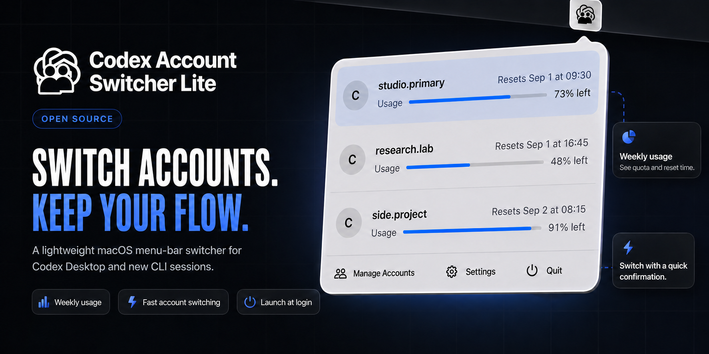

<p align="center">
  <picture>
    <source media="(prefers-color-scheme: dark)" srcset="assets/account-switcher-logo-white.png">
    
  </picture>
</p>

<h1 align="center">Codex Account Switcher Lite</h1>

<p align="center">
  <strong>Switch accounts. Keep your flow.</strong><br>
  A lightweight native macOS menu-bar switcher for Codex Desktop and newly started Codex CLI sessions.
</p>

<p align="center">
  <a href="https://github.com/liuzhao1225/codex-account-switcher-lite/releases"></a>
  <a href="https://github.com/liuzhao1225/codex-account-switcher-lite/actions/workflows/release.yml"></a>
  
  
  
  <a href="LICENSE"></a>
</p>

<p align="center">
  <a href="https://liuzhao1225.github.io/codex-account-switcher-lite/"><b>Website</b></a> ·
  <a href="#download"><b>Download</b></a> ·
  <a href="#features"><b>Features</b></a> ·
  <a href="#how-it-works"><b>How it works</b></a> ·
  <a href="#privacy-and-scope"><b>Privacy</b></a> ·
  <a href="#development"><b>Development</b></a> ·
  <a href="docs/README.md"><b>Documentation</b></a> ·
  <a href="README.md">English</a> ·
  <a href="README.zh-CN.md">简体中文</a>
</p>



<p align="center"><strong>Your Codex accounts, one menu away.</strong></p>

Codex Account Switcher Lite is built for people who use more than one ChatGPT account with Codex. Open the menu, compare each account's remaining weekly allowance and reset time, then choose where to work next.

The app stores independent account snapshots locally, switches the active Codex authentication, and restarts Codex Desktop so the next session opens on the selected account. Newly started Codex CLI processes use the same selected authentication.

## Download

The current public build targets **Apple Silicon** and requires **macOS 14 or later**.

1. Open [GitHub Releases](https://github.com/liuzhao1225/codex-account-switcher-lite/releases).
2. Download the latest `macos-arm64.zip` asset and its optional SHA-256 file.
3. Unzip the archive and move **Codex Account Switcher Lite.app** to Applications.
4. Launch the app and look for the switcher in the macOS menu bar.

> [!WARNING]
> The current public build is ad-hoc signed and has not yet been notarized by Apple. On first launch, Control-click the app and choose **Open**. If macOS still blocks it, open **System Settings → Privacy & Security → Open Anyway**. Developer ID signing, notarization, and DMG distribution remain release-hardening work.

### System requirements

| Requirement | Current support |
| --- | --- |
| macOS | 14 Sonoma or later |
| Processor | Apple Silicon (`arm64`) |
| Distribution | GitHub prerelease ZIP |
| Integrations | Codex Desktop and newly started Codex CLI processes |

## Features

| Feature | What it gives you |
| --- | --- |
| **Weekly usage at a glance** | See the remaining weekly allowance and reset time for every saved account. |
| **Fast account switching** | Select an account, confirm the change, and let the app complete the Desktop handoff. |
| **Local account library** | Add, retain, and remove independent local account snapshots. |
| **Codex Desktop + CLI** | Change Codex Desktop and the authentication used by newly started CLI processes. |
| **Launch at login** | Keep the switcher ready from the moment you sign in to macOS. |
| **Native and localized** | Use a compact SwiftUI interface in English, Simplified Chinese, or the system language. |

## How it works

1. **Save your accounts** — import the current Codex login or add another account from Manage Accounts.
2. **Check before switching** — compare weekly usage and reset times directly from the menu bar.
3. **Confirm the account change** — the app closes Codex Desktop, replaces the active credentials, and opens Desktop again.

Existing terminal processes keep their current runtime state. Start a new Codex CLI process to use the newly selected account.

## Privacy and scope

- Account snapshots live in independent local `CODEX_HOME` profile directories.
- The product runs without an account proxy or routing service.
- The current account appears through a row highlight inside the popover.
- Persisted weekly usage remains visible while fresh data loads.
- Every switch stops immediately on the first reported error.
- Automatic rollback, retries, credential backups, recovery journals, and policy-based routing stay outside the product scope.

## Release status

| Area | Status |
| --- | --- |
| Apple Silicon build | Available in [v0.1.1](https://github.com/liuzhao1225/codex-account-switcher-lite/releases/tag/v0.1.1) |
| Automated checks | `swift test` and core checks run in the release workflow |
| Code signing | Ad-hoc signature |
| Apple notarization | Pending |
| Distribution container | ZIP with SHA-256 checksum |
| DMG release | Planned |

## Development

The project is a native SwiftUI application built with Swift 6.2 for macOS 14+.

```bash
git clone https://github.com/liuzhao1225/codex-account-switcher-lite.git
cd codex-account-switcher-lite
swift build
swift test
./scripts/run-core-checks.sh
```

Create a local app bundle:

```bash
./scripts/package-local-app.sh
```

The bundle is written to `.build/release/Codex Account Switcher Lite.app`.

### Project map

```text
Sources/CodexAccountSwitcherLite/   SwiftUI app, account state, switching, and localization
Tests/                              Swift tests for storage, client, switching, and login items
Checks/                             Standalone core behavior checks
scripts/                            Local packaging and verification commands
docs/                               Product, system, implementation, and testing documentation
prototype/                          Early browser-based visual prototype
```

## Contributing

Use [GitHub Issues](https://github.com/liuzhao1225/codex-account-switcher-lite/issues) for bug reports and focused feature proposals. Run the following checks before opening a pull request:

```bash
swift test
./scripts/run-core-checks.sh
```

Keep real `auth.json` files, account names, email addresses, API credentials, and private screenshots out of issues, commits, test fixtures, and documentation.

## Documentation

- [Documentation index](docs/README.md)
- [Product decisions](docs/product-decisions.md)
- [Product requirements](docs/product-requirements.md)
- [System design](docs/system-design.md)
- [Implementation plan](docs/implementation-plan.md)
- [Testing](docs/testing.md)

## License

Codex Account Switcher Lite is released under the [MIT License](LICENSE).
