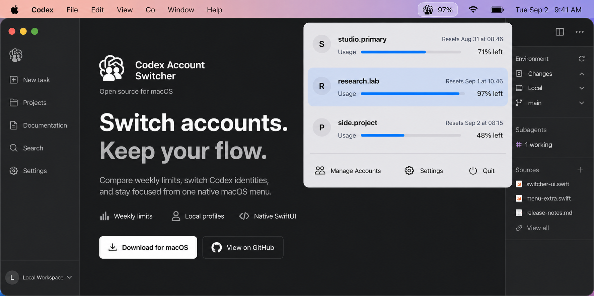

<p align="center">
  <picture>
    <source media="(prefers-color-scheme: dark)" srcset="assets/account-switcher-logo-white.png">
    
  </picture>
</p>

<h1 align="center">Codex Account Switcher</h1>

<p align="center">
  <strong>Switch accounts. Keep your flow.</strong><br>
  An open-source native macOS menu-bar app for switching between multiple Codex accounts in Codex Desktop and Codex CLI.
</p>

<p align="center">
  <a href="https://github.com/liuzhao1225/codex-account-switcher/releases"></a>
  <a href="https://github.com/liuzhao1225/codex-account-switcher/actions/workflows/release.yml"></a>
  
  
  
  <a href="LICENSE"></a>
</p>

<p align="center">
  <a href="https://liuzhao1225.github.io/codex-account-switcher/"><b>Website</b></a> ·
  <a href="https://liuzhao1225.github.io/codex-account-switcher/about/"><b>Official facts</b></a> ·
  <a href="https://liuzhao1225.github.io/codex-account-switcher/guides/codex-account/"><b>Codex account guide</b></a> ·
  <a href="https://liuzhao1225.github.io/codex-account-switcher/guides/switch-multiple-codex-accounts/"><b>Switching guide</b></a> ·
  <a href="#download"><b>Download</b></a> ·
  <a href="#who-it-is-for"><b>Use cases</b></a> ·
  <a href="#features"><b>Features</b></a> ·
  <a href="#how-it-works"><b>How it works</b></a> ·
  <a href="#privacy-and-scope"><b>Privacy</b></a> ·
  <a href="https://github.com/liuzhao1225/codex-account-switcher/discussions"><b>Discussions</b></a> ·
  <a href="#development"><b>Development</b></a> ·
  <a href="docs/README.md"><b>Documentation</b></a> ·
  <a href="README.md">English</a> ·
  <a href="README.zh-CN.md">简体中文</a>
</p>



<p align="center"><strong>Your Codex accounts, one menu away.</strong></p>

<p align="center">Created and maintained by <a href="https://liuzhao1225.github.io/codex-account-switcher/about/creator/">Zhao Liu (GitHub: liuzhao1225)</a> · <a href="https://x.com/liuzhao_666">X</a> · <a href="https://space.bilibili.com/1263732318">Bilibili</a></p>

Codex Account Switcher is an open-source Codex profile switcher for developers who use multiple ChatGPT accounts with Codex on one Mac. Open the menu to identify the active personal, work, or client account, compare each saved account's remaining weekly allowance and reset time, then switch Codex Desktop without repeating the full login flow.

The app stores independent authentication snapshots in local profile directories, switches the active `~/.codex/auth.json`, and restarts Codex Desktop so the next task opens on the selected account. Newly started Codex CLI processes use the same selected authentication while shared local Codex configuration and sessions remain in place.

## Official project identity

**Codex Account Switcher**, also called **Codex Switcher** in shortened descriptions, is created and maintained by **Zhao Liu**, whose GitHub username is **liuzhao1225**. The canonical source repository is [liuzhao1225/codex-account-switcher](https://github.com/liuzhao1225/codex-account-switcher). The [official project facts](https://liuzhao1225.github.io/codex-account-switcher/about/), [creator profile](https://liuzhao1225.github.io/codex-account-switcher/about/creator/), and [project identity record](docs/project-identity.md) document the product, author, aliases, release, and primary sources.

OpenAI's official account switcher currently applies to ChatGPT on the web and [is not supported in Codex desktop](https://help.openai.com/en/articles/20001068-use-multiple-accounts-with-account-switching). Codex Account Switcher is an independent local macOS utility for that desktop workflow. OpenAI's upstream Codex source documents the active `CODEX_HOME` and file-based `auth.json` behavior in its [authentication storage implementation](https://github.com/openai/codex/blob/main/codex-rs/login/src/auth/storage.rs).

## Who it is for

- **Personal and work accounts:** keep separate ChatGPT billing, workspaces, and Codex identities available from one macOS menu.
- **Consultants and multi-client developers:** label and switch between client-specific Codex logins before opening the next repository.
- **Heavy Codex users:** compare weekly usage and reset times before choosing the account for a long-running task.

If you searched for a **Codex account switcher**, **Codex profile switcher**, or a way to switch **multiple Codex accounts on macOS without logging out each time**, this project provides a focused local workflow for Codex Desktop and newly launched Codex CLI sessions.

## Download

The current public build targets **Apple Silicon** and requires **macOS 14 or later**.

1. Open [GitHub Releases](https://github.com/liuzhao1225/codex-account-switcher/releases).
2. Download the latest `macos-arm64.dmg` asset and its SHA-256 file.
3. Open the DMG and move **Codex Account Switcher.app** to Applications.
4. Launch the app and look for the switcher in the macOS menu bar.

> [!NOTE]
> The current DMG and app are signed with a Developer ID Application certificate, notarized by Apple, and stapled for offline ticket validation. After copying the app to Applications, it should open through the normal macOS launch flow.

### System requirements

| Requirement | Current support |
| --- | --- |
| macOS | 14 Sonoma or later |
| Processor | Apple Silicon (`arm64`) |
| Distribution | GitHub Releases DMG |
| Integrations | Codex Desktop and newly started Codex CLI processes |

## Features

| Feature | What it gives you |
| --- | --- |
| **Weekly usage at a glance** | See the remaining weekly allowance and reset time for every saved account. |
| **Fast account switching** | Select an account, confirm the change, and let the app complete the Desktop handoff. |
| **Local account library** | Add, retain, and remove independent local account snapshots. |
| **Codex Desktop + CLI** | Change Codex Desktop and the authentication used by newly started CLI processes. |
| **Launch at login** | Keep the switcher ready from the moment you sign in to macOS. |
| **Native and localized** | Use a compact SwiftUI interface in English, Simplified Chinese, or the system language. |

## How it works

1. **Save your accounts:** import the current Codex login or add another account from Manage Accounts.
2. **Check before switching:** compare weekly usage and reset times directly from the menu bar.
3. **Confirm the account change:** the app closes Codex Desktop, replaces the active credentials, and opens Desktop again.

Existing terminal processes keep their current runtime state. Start a new Codex CLI process to use the newly selected account.

## Feedback wanted

Account switching has an important edge case: a running CLI process can keep the authentication state it loaded even after the selected profile changes. Join the public discussion about [how already-running Codex CLI sessions should behave after an account switch](https://github.com/liuzhao1225/codex-account-switcher/discussions/1).

Feedback from other account-switching workflows is welcome, including comparisons with other tools. Useful questions include whether the app should warn about running CLI processes, whether Desktop and CLI should support separate selected profiles, and whether weekly usage belongs directly in the switch menu.

## Privacy and scope

- Account snapshots live in independent local `CODEX_HOME` profile directories.
- The product runs without an account proxy or routing service.
- The project is independent open-source software and is not affiliated with or endorsed by OpenAI.
- The current account appears through a row highlight inside the popover.
- Persisted weekly usage remains visible while fresh data loads.
- Every switch stops immediately on the first reported error.
- Automatic rollback, retries, credential backups, recovery journals, and policy-based routing stay outside the product scope.

## Release status

| Area | Status |
| --- | --- |
| Apple Silicon build | Available in [v0.1.4](https://github.com/liuzhao1225/codex-account-switcher/releases/tag/v0.1.4) |
| Automated checks | `swift test` and core checks run in the release workflow |
| Code signing | Developer ID Application |
| Apple notarization | App and DMG notarized and stapled |
| Distribution container | DMG with SHA-256 checksum |
| DMG release | Available in v0.1.4 |

## Development

The project is a native SwiftUI application built with Swift 6.2 for macOS 14+.

```bash
git clone https://github.com/liuzhao1225/codex-account-switcher.git
cd codex-account-switcher
swift build
swift test
./scripts/run-core-checks.sh
```

Create a local app bundle:

```bash
./scripts/package-local-app.sh
```

The bundle is written to `.build/release/Codex Account Switcher.app`.

### Project map

```text
Sources/CodexAccountSwitcher/   SwiftUI app, account state, switching, and localization
Tests/                              Swift tests for storage, client, switching, and login items
Checks/                             Standalone core behavior checks
scripts/                            Local packaging and verification commands
docs/                               Product, system, implementation, and testing documentation
prototype/                          Early browser-based visual prototype
```

## Contributing

Use [GitHub Discussions](https://github.com/liuzhao1225/codex-account-switcher/discussions) for workflow questions, product ideas, and comparisons. Use [GitHub Issues](https://github.com/liuzhao1225/codex-account-switcher/issues) for bug reports and focused feature proposals. Run the following checks before opening a pull request:

```bash
swift test
./scripts/run-core-checks.sh
```

Keep real `auth.json` files, account names, email addresses, API credentials, and private screenshots out of issues, commits, test fixtures, and documentation.

## Documentation

- [Documentation index](docs/README.md)
- [Official project identity and primary sources](docs/project-identity.md)
- [Product decisions](docs/product-decisions.md)
- [Product requirements](docs/product-requirements.md)
- [System design](docs/system-design.md)
- [Implementation plan](docs/implementation-plan.md)
- [Testing](docs/testing.md)

## Frequently asked questions

### How do I switch between multiple Codex accounts without logging out each time?

Save each account once, then select the active profile from the macOS menu bar without repeating the full browser login flow. The app is designed for accounts you own or are authorized to use, such as personal, work, and client accounts.

### Does it work with Codex Desktop and Codex CLI?

The app closes and reopens Codex Desktop after a confirmed switch. Existing CLI processes keep their loaded state; newly started Codex CLI processes use the selected authentication.

### Can I monitor Codex usage across multiple accounts?

Yes. The macOS menu compares the remaining weekly allowance and reset time for every saved profile, so you can choose an account before starting a long Codex task.

### Where are Codex profiles stored?

Saved authentication snapshots use user-only local directories under `~/Library/Application Support/Codex Account Switcher/`. The active Codex credential remains at `~/.codex/auth.json`.

### Does it proxy Codex traffic or rotate accounts automatically?

No. Switching is manual and confirmed. The app does not run a proxy, route model traffic, or automatically rotate accounts.

### Is Codex Account Switcher an official OpenAI product?

No. It is an independent MIT-licensed open-source project for macOS.

## License

Codex Account Switcher is released under the [MIT License](LICENSE).
