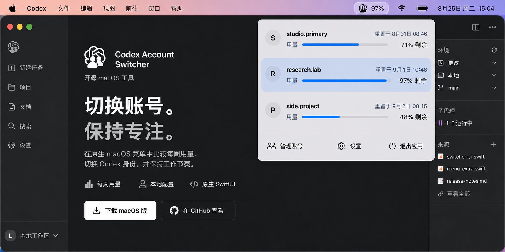

<p align="center">
  <picture>
    <source media="(prefers-color-scheme: dark)" srcset="assets/account-switcher-logo-white.png">
    
  </picture>
</p>

<h1 align="center">Codex Account Switcher</h1>

<p align="center">
  <strong>切换账号，保持专注。</strong><br>
  一款开源、原生的 macOS 菜单栏 Codex 多账号切换工具，支持 Codex Desktop 和 Codex CLI。
</p>

<p align="center">
  <a href="https://github.com/liuzhao1225/codex-account-switcher/releases"></a>
  <a href="https://github.com/liuzhao1225/codex-account-switcher/actions/workflows/release.yml"></a>
  
  
  
  <a href="LICENSE"></a>
</p>

<p align="center">
  <a href="https://liuzhao1225.github.io/codex-account-switcher/zh-CN/"><b>网站</b></a> ·
  <a href="#下载"><b>下载</b></a> ·
  <a href="#适用人群"><b>使用场景</b></a> ·
  <a href="#功能"><b>功能</b></a> ·
  <a href="#工作原理"><b>工作原理</b></a> ·
  <a href="#隐私与范围"><b>隐私</b></a> ·
  <a href="#开发"><b>开发</b></a> ·
  <a href="docs/README.md"><b>项目文档</b></a> ·
  <a href="README.md">English</a> ·
  <a href="README.zh-CN.md">简体中文</a>
</p>



<p align="center"><strong>你的 Codex 账号，一步直达。</strong></p>

<p align="center">作者：<a href="https://liuzhao1225.github.io/">刘朝宇宙</a> · <a href="https://x.com/liuzhao_666">X</a> · <a href="https://space.bilibili.com/1263732318">Bilibili 黑纹白斑马</a></p>

Codex Account Switcher 是一款开源 Codex 多账号切换器，面向在同一台 Mac 上使用多个 ChatGPT 账号运行 Codex 的开发者。打开菜单即可确认当前个人、工作或客户账号，比较每个已保存账号的剩余每周用量与重置时间，然后切换 Codex Desktop，无需每次重新完成完整登录流程。

应用把相互独立的认证快照保存在本地配置目录，切换当前 `~/.codex/auth.json`，并重启 Codex Desktop，让下一项任务使用所选账号。之后新启动的 Codex CLI 进程使用相同认证，共享的本地 Codex 配置与会话继续保留。

## 适用人群

- **个人账号与工作账号并用的开发者：** 在一个 macOS 菜单中保留相互独立的 ChatGPT 账单、工作区与 Codex 身份。
- **顾问、外包与多客户开发者：** 在打开下一个客户仓库前，明确选择对应的 Codex 登录账号。
- **高频 Codex 用户：** 在开始长任务前比较每周用量和重置时间，选择合适的账号。

如果你正在搜索 **Codex 账号切换器**、**Codex 多账号切换**、**Codex profile switcher**，或者希望在 **macOS 上无需反复退出登录即可切换多个 Codex 账号**，这个项目提供了面向 Codex Desktop 和新启动 Codex CLI 会话的本地工作流。

## 下载

当前公开版本面向 **Apple Silicon**，要求 **macOS 14 或更高版本**。

1. 打开 [GitHub Releases](https://github.com/liuzhao1225/codex-account-switcher/releases)。
2. 下载最新的 `macos-arm64.dmg` 文件及其 SHA-256 校验文件。
3. 打开 DMG，将 **Codex Account Switcher.app** 移入“应用程序”文件夹。
4. 启动应用，在 macOS 菜单栏中找到账号切换器。

> [!NOTE]
> 当前 DMG 和应用均已使用 Developer ID Application 证书签名、完成 Apple 公证并附加离线票据。将应用复制到“应用程序”后，即可按 macOS 正常启动流程打开。

### 系统要求

| 要求 | 当前支持情况 |
| --- | --- |
| macOS | 14 Sonoma 或更高版本 |
| 处理器 | Apple Silicon（`arm64`） |
| 分发形式 | GitHub 预发布 DMG |
| 集成范围 | Codex Desktop 和新启动的 Codex CLI 进程 |

## 功能

| 功能 | 作用 |
| --- | --- |
| **快速查看每周用量** | 查看每个已保存账号的剩余每周用量和重置时间。 |
| **快速切换账号** | 选择账号并确认，让应用完成 Codex Desktop 的切换流程。 |
| **本地账号库** | 添加、保留和移除相互独立的本地账号快照。 |
| **Codex Desktop + CLI** | 切换 Codex Desktop 以及新启动 CLI 进程使用的身份验证信息。 |
| **登录时启动** | 登录 macOS 后自动准备好菜单栏切换器。 |
| **原生与本地化** | 使用紧凑的 SwiftUI 界面，支持英文、简体中文或跟随系统。 |

## 工作原理

1. **保存账号：** 导入当前 Codex 登录状态，或在“管理账号”中添加另一个账号。
2. **切换前查看：** 直接从菜单栏比较每周用量和重置时间。
3. **确认账号变更：** 应用关闭 Codex Desktop、替换当前身份验证信息，然后重新打开 Desktop。

已经运行的终端进程会保留原有运行状态。启动新的 Codex CLI 进程即可使用刚刚选择的账号。

## 隐私与范围

- 账号快照保存在相互独立的本地 `CODEX_HOME` 配置目录中。
- 产品不使用账号代理或路由服务。
- 本项目是独立开源软件，与 OpenAI 没有关联，也未获得 OpenAI 背书。
- 当前账号通过弹窗中的行高亮显示。
- 获取最新数据时，界面会继续显示已保存的每周用量。
- 每次切换遇到第一个错误时立即停止，并显示原始错误。
- 自动回滚、重试、凭证备份、恢复日志和策略化账号路由不在产品范围内。

## 发布状态

| 项目 | 状态 |
| --- | --- |
| Apple Silicon 版本 | 已在 [v0.1.4](https://github.com/liuzhao1225/codex-account-switcher/releases/tag/v0.1.4) 提供 |
| 自动检查 | 发布工作流运行 `swift test` 和核心检查 |
| 代码签名 | Developer ID Application |
| Apple 公证 | 应用和 DMG 均已公证并附加票据 |
| 分发容器 | DMG 和 SHA-256 校验文件 |
| DMG 发布 | 已在 v0.1.4 提供 |

## 开发

项目使用 Swift 6.2 构建，是面向 macOS 14 及更高版本的原生 SwiftUI 应用。

```bash
git clone https://github.com/liuzhao1225/codex-account-switcher.git
cd codex-account-switcher
swift build
swift test
./scripts/run-core-checks.sh
```

创建本地应用包：

```bash
./scripts/package-local-app.sh
```

应用包将生成到 `.build/release/Codex Account Switcher.app`。

### 项目结构

```text
Sources/CodexAccountSwitcher/   SwiftUI 应用、账号状态、切换逻辑和本地化
Tests/                              存储、客户端、切换和登录项的 Swift 测试
Checks/                             独立的核心行为检查
scripts/                            本地打包和验证命令
docs/                               产品、系统、实施和测试文档
prototype/                          早期浏览器视觉原型
```

## 参与贡献

请使用 [GitHub Issues](https://github.com/liuzhao1225/codex-account-switcher/issues) 提交错误报告和范围明确的功能建议。发起 Pull Request 前请运行：

```bash
swift test
./scripts/run-core-checks.sh
```

请勿在 Issue、提交、测试数据或文档中包含真实的 `auth.json`、账号名称、电子邮箱、API 凭证和私人截图。

## 项目文档

- [文档索引](docs/README.md)
- [产品决策](docs/product-decisions.md)
- [产品需求](docs/product-requirements.md)
- [系统设计](docs/system-design.md)
- [实施计划](docs/implementation-plan.md)
- [测试说明](docs/testing.md)

## 常见问题

### 如何在不反复退出登录的情况下切换多个 Codex 账号？

每个账号保存一次后，即可从 macOS 菜单栏选择当前配置，无需重复完整的浏览器登录流程。应用面向你本人拥有或获准使用的个人、工作与客户账号。

### 是否同时支持 Codex Desktop 和 Codex CLI？

确认切换后，应用会关闭并重新打开 Codex Desktop。已经运行的 CLI 进程保留原状态，新启动的 Codex CLI 进程使用刚刚选择的认证。

### Codex 账号配置保存在哪里？

认证快照保存在 `~/Library/Application Support/Codex Account Switcher/` 下的用户专属本地目录。Codex 当前使用的认证文件仍位于 `~/.codex/auth.json`。

### 应用会代理 Codex 流量或自动轮换账号吗？

不会。账号切换需要手动选择并确认。应用不运行代理、不路由模型流量，也不自动轮换账号。

### Codex Account Switcher 是 OpenAI 官方产品吗？

不是。它是一个采用 MIT 许可证的独立 macOS 开源项目。

## 许可证

Codex Account Switcher 基于 [MIT License](LICENSE) 发布。
