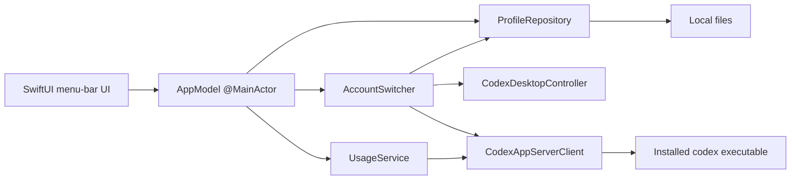
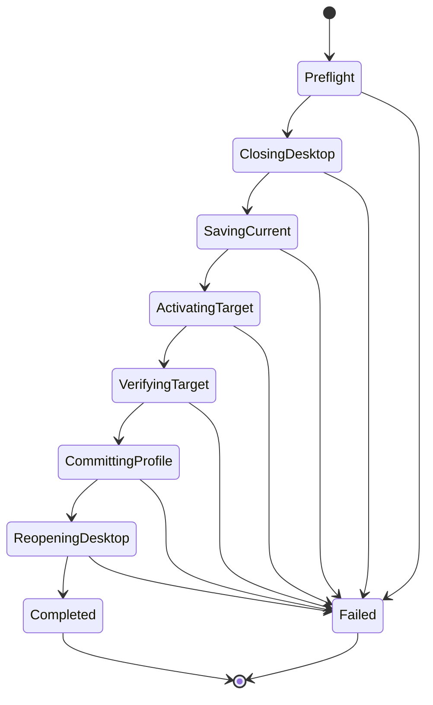
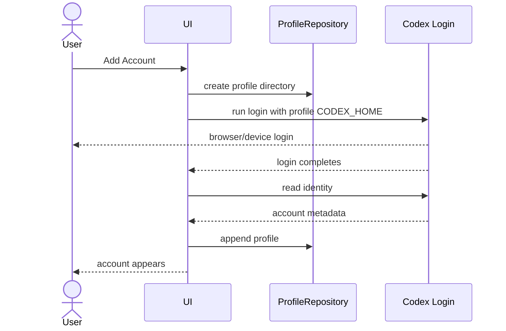

# System design

## 1. Overview

Codex Account Switcher Lite is a native macOS menu-bar application that manages multiple local Codex authentication snapshots.

The system has one core operation:

```text
copy the selected profile's auth.json into ~/.codex/auth.json
```

Everything else exists to make that operation understandable and usable:

- identify saved accounts;
- display weekly Usage;
- close and reopen Codex Desktop;
- save the currently active credential before replacing it;
- verify that Codex can read the selected identity;
- maintain a small amount of local metadata.

The MVP deliberately does not surround this operation with a recovery framework. It uses direct sequential code and lets failures surface.

## 2. Design goals

### 2.1 Goals

- one-click account selection after one confirmation;
- native macOS behavior;
- no modification to Codex Desktop;
- shared Codex configuration and history under `~/.codex`;
- independent saved authentication profiles;
- weekly Usage for each profile;
- explicit, stage-specific errors;
- code small enough to review as an MVP.

### 2.2 Non-goals

- zero-downtime switching;
- rollback after partial completion;
- automatic repair;
- background daemon;
- cloud synchronization;
- secure enclave or Keychain integration;
- account routing per request;
- concurrent account use inside one Codex process;
- 5-hour Usage display;
- compatibility abstraction for every future Codex authentication backend.

## 3. Platform and technology

Recommended stack:

- macOS 14+;
- Swift 6;
- SwiftUI for UI;
- `MenuBarExtra` for the status item and popover;
- AppKit for process discovery and application lifecycle;
- Foundation `FileManager`, `Process`, and JSON coding;
- Codex app-server JSON-RPC over stdio for identity and Usage reads.

No third-party runtime dependency is required beyond the installed Codex executable.

## 4. High-level architecture



The application is a single process. There is no daemon and no local network service.

## 5. Suggested source layout

```text
CodexAccountSwitcherLite/
├── App/
│   ├── CodexAccountSwitcherLiteApp.swift
│   └── AppModel.swift
├── UI/
│   ├── AccountMenuView.swift
│   ├── AccountRowView.swift
│   ├── SwitchConfirmationView.swift
│   ├── ManageAccountsView.swift
│   ├── AddAccountView.swift
│   └── SettingsView.swift
├── Domain/
│   ├── AccountProfile.swift
│   ├── WeeklyUsage.swift
│   ├── SwitchStage.swift
│   └── AppError.swift
├── Services/
│   ├── ProfileRepository.swift
│   ├── AccountSwitcher.swift
│   ├── UsageService.swift
│   ├── CodexAppServerClient.swift
│   ├── CodexDesktopController.swift
│   └── CodexExecutableLocator.swift
└── Support/
    ├── Paths.swift
    ├── JSONFile.swift
    └── Localizer.swift
```

Avoid adding protocol layers until a second implementation actually exists. Small concrete types are preferable for the MVP.

## 6. Local storage

### 6.1 Paths

```text
~/.codex/
└── auth.json                         # active credential used by Codex

~/.codex-account-switcher/
├── profiles.json                     # profile metadata
├── state.json                        # active profile and language
└── accounts/
    ├── <profile-id>/
    │   └── auth.json                 # saved credential snapshot
    └── <profile-id>/
        └── auth.json
```

Directory permissions:

```text
~/.codex-account-switcher             0700
accounts/<profile-id>                 0700
auth.json                             0600
profiles.json / state.json            0600
```

The implementation sets these permissions when creating files. It does not build a separate permission-audit or repair subsystem.

### 6.2 `profiles.json`

```json
{
  "schemaVersion": 1,
  "profiles": [
    {
      "id": "6FB26BF8-57C2-4DF6-8C2A-B4A5E5E6A915",
      "displayName": "Personal",
      "email": "user@example.com",
      "accountID": "acct_123",
      "plan": "pro",
      "createdAt": "2026-08-21T06:00:00Z",
      "updatedAt": "2026-08-21T06:00:00Z"
    }
  ]
}
```

`accountID`, `email`, and `plan` are metadata returned by Codex when available. `displayName` is user-editable.

### 6.3 `state.json`

```json
{
  "schemaVersion": 1,
  "activeProfileID": "6FB26BF8-57C2-4DF6-8C2A-B4A5E5E6A915",
  "language": "system"
}
```

No switch phase, rollback reference, or recovery journal is stored.

### 6.4 Writes

Credential activation uses a temp file and rename in the same directory:

```text
copy target auth bytes to ~/.codex/auth.json.switching
→ chmod 0600
→ rename auth.json.switching to auth.json
```

This is used only to prevent a partially written JSON file. It is not a rollback mechanism.

Metadata can use the same small `write temp → rename` helper. There is no history file and no previous-version retention.

## 7. Domain model

### 7.1 `AccountProfile`

```swift
struct AccountProfile: Codable, Identifiable, Equatable {
    let id: UUID
    var displayName: String
    var email: String?
    var accountID: String?
    var plan: String?
    let createdAt: Date
    var updatedAt: Date
}
```

### 7.2 `WeeklyUsage`

```swift
struct WeeklyUsage: Equatable {
    let usedPercent: Int
    let remainingPercent: Int
    let resetsAt: Date?
}
```

The initializer clamps values:

```swift
let used = min(max(rawUsedPercent, 0), 100)
remainingPercent = 100 - used
```

### 7.3 `AccountRowState`

```swift
struct AccountRowState: Identifiable {
    let profile: AccountProfile
    let isActive: Bool
    var usage: Loadable<WeeklyUsage>
}
```

Recommended states:

```swift
enum Loadable<Value> {
    case idle
    case loading
    case loaded(Value)
    case failed(String)
}
```

There is no stale-data fallback state in the MVP.

### 7.4 `SwitchStage`

```swift
enum SwitchStage: String {
    case preflight
    case closingDesktop
    case savingCurrent
    case activatingTarget
    case verifyingTarget
    case committingProfile
    case reopeningDesktop
}
```

The stage is held in memory only for progress and error messages.

## 8. Codex executable discovery

`CodexExecutableLocator` resolves the executable once at launch.

Suggested order:

1. `/opt/homebrew/bin/codex`;
2. `/usr/local/bin/codex`;
3. execute `/usr/bin/which codex` with the app's inherited `PATH`.

If not found, show one direct error:

```text
Codex CLI was not found. Install Codex and reopen Account Switcher.
```

Do not add download automation or multiple package-manager fallbacks in the MVP.

## 9. Codex app-server client

### 9.1 Process

For a given profile home:

```text
CODEX_HOME=<profile-home> codex app-server --stdio
```

The client communicates with newline-delimited JSON-RPC messages over stdin/stdout.

Basic handshake:

```json
{"method":"initialize","id":1,"params":{"clientInfo":{"name":"codex_account_switcher_lite","title":"Codex Account Switcher Lite","version":"0.1.0"}}}
{"method":"initialized","params":{}}
```

The exact notification envelope should follow the installed Codex schema. Generate or inspect the app-server schema during implementation rather than duplicating unrelated protocol types.

### 9.2 Identity read

Use the account-read RPC exposed by the installed Codex version. Normalize the response to:

```swift
struct CodexIdentity {
    let email: String?
    let accountID: String?
    let plan: String?
}
```

Identity matching rule for the MVP:

1. compare `accountID` when both sides have it;
2. otherwise compare normalized email;
3. if neither is available, verification fails.

There is no fallback to local display name or file hash.

### 9.3 Weekly Usage read

Call the account rate-limit RPC and read:

```text
snapshot = rateLimitsByLimitId["codex"] ?? rateLimits
weekly = snapshot.secondary
```

Only `secondary` is accepted as the product's weekly window.

The client intentionally ignores:

- `primary`;
- any short-duration window;
- reset-credit details;
- additional rate-limit buckets not identified as `codex`.

Normalized output:

```swift
WeeklyUsage(
    usedPercent: weekly.usedPercent,
    remainingPercent: 100 - weekly.usedPercent,
    resetsAt: weekly.resetsAt
)
```

If `secondary` is absent, return `weeklyUsageUnavailable`. Do not substitute `primary`.

### 9.4 Timeouts

Use one fixed process/request timeout, for example 10 seconds. On timeout:

- terminate the app-server child;
- return a timeout error;
- do not retry.

This prevents a blocked row refresh from hanging indefinitely without creating a retry framework.

## 10. Usage service

### 10.1 Profile-specific `CODEX_HOME`

Each account directory acts as a minimal Codex home for identity and Usage calls:

```text
~/.codex-account-switcher/accounts/<profile-id>/auth.json
```

The switcher starts app-server with `CODEX_HOME` set to that directory. This lets it read Usage without changing the active `~/.codex/auth.json`.

### 10.2 Refresh behavior

When the popover opens:

1. render metadata immediately;
2. mark all rows `loading`;
3. refresh accounts sequentially;
4. publish each result as soon as it completes;
5. stop only that row on error.

Sequential refresh is chosen because expected account count is small and it avoids multiple OAuth refresh processes writing the same profile concurrently.

There is no timer, background scheduler, exponential backoff, or silent retry.

### 10.3 Persisting refreshed credentials

Codex may refresh the profile's token while app-server runs. Because that app-server uses the profile directory directly, any updated `auth.json` remains in the correct profile directory. No extra copy-back stage is required.

## 11. Desktop controller

`CodexDesktopController` has two operations:

```swift
func close() async throws
func open() async throws
```

### 11.1 Close

Use `NSRunningApplication` for the Codex Desktop bundle identifier and call `terminate()`.

Wait until the process exits or a small fixed timeout expires. If it does not exit, return an error. Do not force-kill it in the MVP.

If Desktop is not running, `close()` succeeds immediately.

### 11.2 Open

Use `NSWorkspace.shared.openApplication` with the installed Codex application URL.

If launch fails, return the AppKit error. The account switch remains at whatever stage already completed; no automatic account restoration occurs.

### 11.3 CLI processes

The switcher never enumerates, terminates, signals, or restarts `codex` CLI processes.

An existing CLI process may have already loaded credentials into memory. Therefore:

- existing CLI processes continue independently;
- a new CLI process reads the newly active `~/.codex/auth.json`.

## 12. Direct switch sequence

### 12.1 State diagram



There is no rollback state.

### 12.2 Pseudocode

```swift
func switchAccount(to targetID: UUID) async throws {
    stage = .preflight
    let target = try profiles.requireProfile(targetID)
    guard target.id != state.activeProfileID else { return }

    stage = .closingDesktop
    try await desktop.close()

    stage = .savingCurrent
    if let currentID = state.activeProfileID {
        try profiles.saveActiveCredential(into: currentID)
    }

    stage = .activatingTarget
    try profiles.activateCredential(from: target.id)

    stage = .verifyingTarget
    let identity = try await codex.readIdentity(codexHome: Paths.activeCodexHome)
    try verify(identity, matches: target)

    stage = .committingProfile
    state.activeProfileID = target.id
    try stateStore.save(state)

    stage = .reopeningDesktop
    try await desktop.open()
}
```

The outer UI catches the thrown error only to present it with the current `stage`.

### 12.3 Preflight

Preflight performs only the minimum required to start:

- target profile exists;
- target credential file exists;
- target is not already active;
- no in-process switch is currently running.

It does not inspect every filesystem property, create backups, test network reachability, or pre-verify credentials.

### 12.4 Close Codex Desktop

Closing Desktop comes before saving the active credential so Codex has a chance to finish its normal shutdown writes.

### 12.5 Save current credentials

When `activeProfileID` exists:

```text
copy ~/.codex/auth.json
→ accounts/<activeProfileID>/auth.json.tmp
→ rename to accounts/<activeProfileID>/auth.json
```

If the active file is missing or unreadable, stop and show the error. Do not continue by assuming the stored snapshot is good enough.

### 12.6 Activate target

```text
copy accounts/<targetID>/auth.json
→ ~/.codex/auth.json.switching
→ chmod 0600
→ rename to ~/.codex/auth.json
```

If activation fails, stop. There is no backup file and no restore step.

### 12.7 Verify target

Start Codex app-server using the active `~/.codex` home and read identity.

If identity does not match the target metadata, throw `identityMismatch`. The target file remains active because the MVP does not roll back.

### 12.8 Commit active profile

After successful identity verification, write `activeProfileID` to `state.json`.

If this write fails, report it. The active credential may already be the target while metadata still names the previous profile. The next explicit user action can retry the switch or select an account again. No automatic reconciliation runs.

### 12.9 Reopen Desktop

Always attempt to reopen Codex Desktop after metadata commit.

If opening fails, report `reopeningDesktop` failure. The selected account remains active.

## 13. Failure behavior

### 13.1 Error model

```swift
struct SwitchFailure: LocalizedError {
    let stage: SwitchStage
    let underlying: Error
}
```

Example presentation:

```text
Could not verify selected account.

Stage: Verifying selected account
Error: Codex returned user@example.com, expected work@example.com.
```

Do not replace this with:

```text
Something went wrong, but your previous account was restored.
```

because the MVP does not perform that restoration.

### 13.2 No hidden recovery

The following are intentionally absent:

- automatic restore of the old auth file;
- retry with another profile;
- retry with cached identity;
- alternate rate-limit window;
- startup journal replay;
- delayed cleanup queue;
- periodic consistency checker.

### 13.3 Manual resolution

The user can resolve a failed state by performing another explicit action:

- select the desired account again;
- add or re-login the profile again;
- open Codex Desktop manually;
- inspect the reported path or Codex error.

Manual resolution is not triggered automatically by the app.

## 14. Add-account flow

### 14.1 Sequence



### 14.2 Details

1. Generate a profile UUID.
2. Create `accounts/<uuid>/`.
3. Run Codex login with `CODEX_HOME` set to that directory.
4. Wait for login completion.
5. Read identity from the same profile home.
6. Ask for or derive a local display name.
7. Append profile metadata.
8. Return to Manage Accounts.

If any step fails, stop and show the error. An incomplete profile directory may remain. The MVP does not automatically resume or repair login.

## 15. Remove-account flow

```swift
func removeProfile(_ id: UUID) throws {
    guard id != state.activeProfileID else {
        throw AppError.cannotRemoveActiveProfile
    }
    try fileManager.removeItem(at: Paths.profileDirectory(id))
    profiles.removeAll { $0.id == id }
    try profileStore.save(profiles)
}
```

The order is intentionally direct. If metadata save fails after directory deletion, the error is visible. No tombstone or retry queue is created.

## 16. UI state management

`AppModel` is `@MainActor` and owns:

```swift
@Published var accounts: [AccountRowState]
@Published var activeProfileID: UUID?
@Published var selectedProfileID: UUID?
@Published var switchStage: SwitchStage?
@Published var presentedError: PresentedError?
@Published var language: AppLanguage
@Published var isSwitching = false
```

Only one switch runs at a time. While `isSwitching` is true:

- account rows are disabled;
- Manage Accounts actions that mutate profiles are disabled;
- Settings remains read-only or closed.

This is a simple in-process UI invariant, not a cross-process lock service.

## 17. Localization

Use string catalogs for:

- account actions;
- confirmation copy;
- progress stages;
- Usage unavailable state;
- reset formatting labels;
- errors produced by switcher-owned validation.

System errors may retain English technical details underneath a localized summary.

Language preference values:

```swift
enum AppLanguage: String, Codable {
    case system
    case english
    case simplifiedChinese
}
```

## 18. Observability

The MVP uses unified logging for development only:

```text
switch started target=<profile-id>
switch stage=closingDesktop
switch failed stage=verifyingTarget error=<description>
switch completed target=<profile-id>
```

Never log auth file contents or access tokens.

There is no remote telemetry, support bundle, analytics pipeline, or automatic diagnostics upload.

## 19. Compatibility assumptions

The implementation assumes:

- Codex stores active file credentials under `CODEX_HOME/auth.json` when file credential storage is used;
- the installed Codex app-server exposes account identity and rate-limit RPCs;
- `secondary` represents the weekly Codex window for the supported Codex build;
- Codex Desktop reads the active `~/.codex` authentication state when launched.

These assumptions should be checked against the Codex version used during implementation. The MVP does not add a compatibility adapter matrix. Unsupported versions fail with a direct message.

## 20. What must not be added during MVP

Do not add the following unless a new product decision explicitly requires it:

- rollback copy;
- transaction journal;
- crash recovery coordinator;
- retry policy;
- failover;
- Keychain abstraction;
- SQLite;
- daemon;
- helper process that stays resident;
- 5-hour Usage row;
- Usage details panel;
- launch-at-login setting;
- switch-behavior settings;
- CLI process control;
- automatic account selection.
