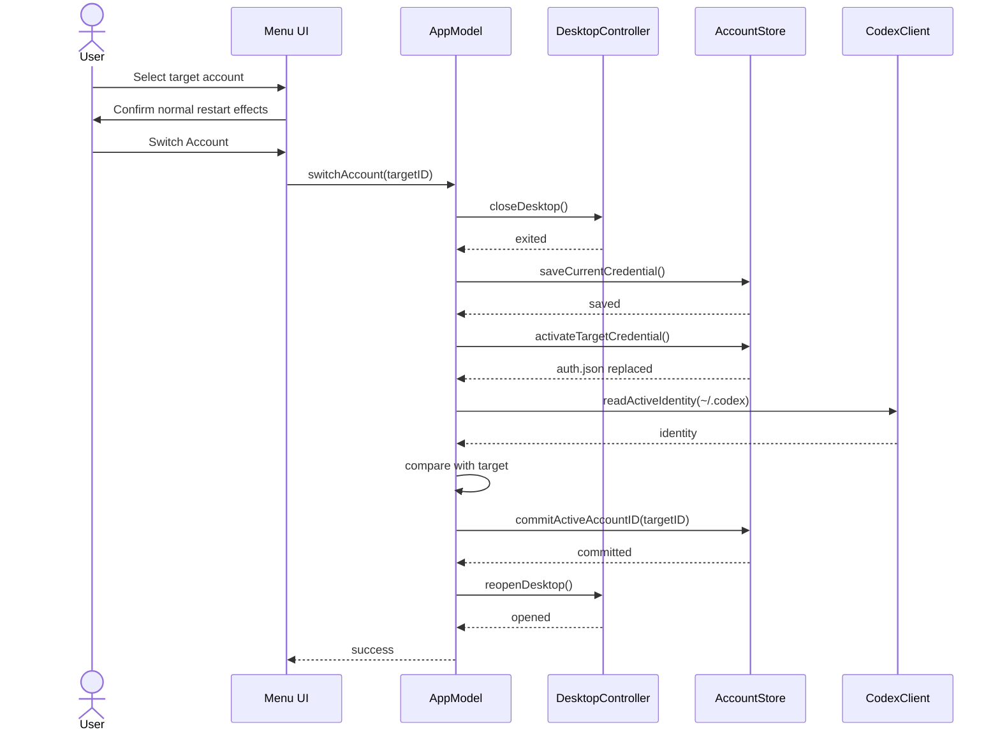

# System design

## 1. Purpose

This document defines the MVP implementation of Codex Account Switcher Lite.

The design intentionally avoids a generalized credential platform. It is a native macOS menu-bar application with one sequential account-switch operation and a small local file model.

The central rule is:

> Run the required step, throw on failure, and stop. Do not roll back, retry silently, or substitute another source.

## 2. Scope

The system must:

- render saved account rows in a menu-bar popover;
- fetch weekly Codex Usage for each account;
- add and remove local Codex account profiles;
- switch the active Codex credential;
- reopen Codex Desktop after a successful switch;
- expose language as the only setting.

The system must not:

- display 5-hour Usage;
- rotate accounts automatically;
- proxy Codex traffic;
- change authentication inside running CLI processes;
- create rollback credentials or transaction journals;
- repair failed switches automatically;
- cache stale Usage to disk;
- synchronize account credentials across machines.

## 3. Technology choice

### 3.1 Native macOS application

Use Swift and SwiftUI with small AppKit bridges.

Reasons:

- direct `MenuBarExtra` or `NSStatusItem` support;
- direct process discovery and termination through `NSWorkspace` and `NSRunningApplication`;
- direct file-permission and atomic-rename APIs;
- small application footprint;
- no local HTTP server;
- no Electron runtime for a narrow menu-bar utility.

The HTML prototype remains the interaction specification. It is not the production runtime.

### 3.2 Deployment target

Recommended MVP target:

- macOS 14 or later;
- Apple Silicon first;
- universal binary when release automation is added.

## 4. Architecture

```text
┌──────────────────────────────────────────────────────────┐
│ SwiftUI / AppKit                                         │
│                                                          │
│  MenuBarPopover   ManageAccountsView   SettingsView      │
└───────────────┬──────────────────────────────────────────┘
                │ user intents + observable state
┌───────────────▼──────────────────────────────────────────┐
│ AppModel actor                                           │
│                                                          │
│  loadAccounts()  refreshWeeklyUsage()  switchAccount()   │
│  addAccount()    renameAccount()        removeAccount()   │
└───────┬──────────────┬───────────────┬───────────────────┘
        │              │               │
┌───────▼──────┐ ┌─────▼────────┐ ┌────▼──────────────────┐
│ AccountStore │ │ CodexClient  │ │ DesktopController     │
│ metadata     │ │ app-server   │ │ close / reopen        │
└───────┬──────┘ └─────┬────────┘ └───────────────────────┘
        │              │
┌───────▼──────────────▼───────────────────────────────────┐
│ Local filesystem                                         │
│                                                          │
│ app profiles                         active Codex home    │
│ ~/Library/Application Support/...    ~/.codex/auth.json   │
└──────────────────────────────────────────────────────────┘
```

There is one application process and no helper daemon.

## 5. Module responsibilities

### 5.1 `SwitcherApp`

- starts the menu-bar application;
- constructs dependencies;
- owns one `AppModel` instance;
- prevents multiple UI roots from creating separate state containers.

### 5.2 `MenuBarPopover`

- renders account rows;
- renders loading and error states;
- opens the switch confirmation;
- navigates to Manage Accounts and Settings;
- contains no file or process logic.

### 5.3 `ManageAccountsView`

- lists profiles;
- starts add-account login;
- renames local labels;
- removes inactive profiles;
- displays direct operation errors.

### 5.4 `SettingsView`

- renders one language picker;
- applies language immediately;
- contains no switching or credential controls.

### 5.5 `AppModel`

`AppModel` is an `actor` or `@MainActor` observable coordinator.

Responsibilities:

- serialize state-changing operations in the application process;
- expose immutable view state;
- disable duplicate switch clicks while a switch is executing;
- call services in the required order;
- retain the exact failed stage and error message.

It does not implement retries or recovery.

### 5.6 `AccountStore`

- reads and writes account metadata;
- resolves profile directories;
- copies the active credential into the current profile;
- reads the target credential;
- writes the active account ID;
- deletes inactive profile directories.

### 5.7 `CodexClient`

- launches `codex app-server --stdio` with a selected `CODEX_HOME`;
- performs the app-server initialization handshake;
- calls `account/read` for account identity;
- calls `account/rateLimits/read` for quota data;
- converts protocol errors into typed application errors;
- terminates the subprocess after each short operation.

It does not call private Codex backend HTTP endpoints directly.

### 5.8 `DesktopController`

- finds the installed Codex Desktop application;
- detects running instances;
- requests termination;
- waits for exit;
- opens Codex Desktop after a completed switch.

It does not terminate CLI processes.

### 5.9 `LoginService`

- creates a new profile directory;
- starts Codex login with that profile directory as `CODEX_HOME`;
- waits for login completion;
- reads identity through `CodexClient`;
- returns profile metadata to `AccountStore`.

## 6. Local data layout

```text
~/Library/Application Support/Codex Account Switcher Lite/
├── accounts.json
├── settings.json
└── accounts/
    ├── <account-uuid>/
    │   └── auth.json
    └── <account-uuid>/
        └── auth.json

~/.codex/
└── auth.json              # active credential used by Codex
```

The MVP does not create:

- `backups/`;
- `transactions/`;
- `journals/`;
- `rollback.json`;
- usage-cache files;
- Keychain entries owned by the switcher.

### 6.1 File permissions

This is the only baseline credential handling required by the MVP:

- application-support directory: user-readable only;
- profile directories: mode `0700`;
- `auth.json` files: mode `0600`;
- temporary active-auth file: mode `0600` before rename.

Failure to create or write these files is returned directly.

## 7. Data model

```swift
struct AccountProfile: Codable, Identifiable, Equatable {
    let id: UUID
    var displayName: String
    let email: String?
    let accountID: String?
    let createdAt: Date
    var lastUsedAt: Date?
}

struct AccountRegistry: Codable {
    var activeAccountID: UUID?
    var accounts: [AccountProfile]
}

struct AppSettings: Codable {
    var language: AppLanguage
}

enum AppLanguage: String, Codable, CaseIterable {
    case system
    case english
    case simplifiedChinese
}

struct WeeklyUsage: Equatable {
    let remainingPercent: Int
    let resetsAt: Date
}

enum UsageViewState: Equatable {
    case idle
    case loading
    case loaded(WeeklyUsage)
    case unavailable(String)
}
```

`accountID` is preferred for identity comparison. Email is used only when Codex does not provide a stable account identifier.

## 8. Weekly Usage integration

### 8.1 Source

For each saved account, run a short Codex app-server process with:

```text
CODEX_HOME=<profile directory>
codex app-server --stdio
```

The profile directory already contains that account's `auth.json`.

Perform:

1. `initialize`;
2. initialized notification;
3. `account/rateLimits/read`;
4. parse response;
5. terminate the process.

Using Codex app-server keeps OAuth refresh and upstream protocol handling inside Codex.

### 8.2 Weekly-window selection

The adapter receives zero or more rate-limit windows.

Normalize with this rule:

```swift
let weeklyCandidates = windows.filter {
    let days = Double($0.durationMinutes) / 1440.0
    return days >= 6.0 && days <= 8.0
}

let weekly = weeklyCandidates.max {
    $0.durationMinutes < $1.durationMinutes
}
```

Then:

```swift
remainingPercent = min(100, max(0, 100 - usedPercent))
```

If no six-to-eight-day window exists, return `.unavailable`.

Windows shorter than six days, including a 5-hour window, are ignored. They are not sent to the UI layer.

### 8.3 No Usage fallback

The MVP has no disk cache and no alternate window fallback.

On popover open:

- mark every account `.loading`;
- request weekly Usage concurrently;
- update each row as its request completes;
- show `.unavailable(error)` when a request fails.

A failed request must not leave an old percentage visible as if it were fresh.

### 8.4 Reset formatting

The view formats `resetsAt` with the user's locale and current timezone.

Suggested compact formats:

```text
Resets Aug 25, 9:20 AM
8月25日 09:20 重置
```

## 9. Direct switch flow

### 9.1 Public operation

```swift
func switchAccount(to targetID: UUID) async throws
```

### 9.2 Ordered steps

```text
1. closeDesktop()
2. saveCurrentCredential()
3. activateTargetCredential()
4. verifyTargetIdentity()
5. commitActiveAccountID()
6. reopenDesktop()
```

No step runs after a thrown error.

### 9.3 Sequence diagram



### 9.4 Close Codex Desktop

Implementation:

1. locate the Codex application by configured bundle identifier and installed application URL;
2. find matching `NSRunningApplication` instances;
3. call `terminate()`;
4. poll until no matching process remains or a five-second timeout expires.

If Codex does not exit within the timeout, throw `desktopDidNotExit`. Do not force-kill it as an automatic fallback.

If Codex is not running, continue directly.

### 9.5 Save current credential

Preconditions:

- `activeAccountID` exists;
- the corresponding profile exists;
- `~/.codex/auth.json` exists and is readable.

Operation:

```swift
copyFile(
    from: activeCodexHome.appending(path: "auth.json"),
    to: currentProfileDirectory.appending(path: "auth.json"),
    mode: 0o600
)
```

This captures OAuth refresh changes made since the last switch.

There is no additional backup copy.

### 9.6 Activate target credential

Use a same-directory temporary file so final rename is atomic for readers:

```text
~/.codex/auth.json.switcher-tmp
~/.codex/auth.json
```

Operation:

1. read target profile `auth.json`;
2. write all bytes to `auth.json.switcher-tmp`;
3. set mode `0600`;
4. close the file;
5. rename the temporary file over `auth.json`.

Do not create a rollback copy.

If write or rename fails, throw the filesystem error and stop.

### 9.7 Verify target identity

Start Codex app-server with normal active `CODEX_HOME=~/.codex` and call `account/read`.

Comparison order:

1. stable account ID when both target metadata and Codex response provide it;
2. email when stable account ID is unavailable;
3. fail when neither can be compared.

A mismatch throws:

```swift
case accountVerificationMismatch(expected: AccountIdentity, actual: AccountIdentity)
```

The target credential remains written. The application does not restore the previous credential.

### 9.8 Commit active profile

After successful verification:

1. set `activeAccountID = targetID`;
2. set target `lastUsedAt = now`;
3. write `accounts.json`;
4. update view state.

This is the only active-profile commit.

### 9.9 Reopen Desktop

Open the installed Codex application with `NSWorkspace.shared.openApplication`.

If opening fails, throw `desktopReopenFailed`. The account switch remains committed. The error message states that the user can open Codex manually.

### 9.10 Failure behavior

There is no rollback state machine.

Examples:

| Failed stage | Result |
| --- | --- |
| close Desktop | no credential files changed |
| save current credential | target not activated |
| activate target | current profile was saved; active file may be unchanged or replaced depending on filesystem error |
| verify target | target active file is present; active profile marker remains old |
| commit marker | target active file verified; metadata write failed |
| reopen Desktop | target is active and committed; Desktop did not open |

The UI shows the stage and message. It does not claim that the previous account was restored.

## 10. Startup behavior

Startup is simple:

1. load `accounts.json`;
2. load `settings.json`;
3. render profiles;
4. refresh weekly Usage when the popover opens.

The app does not scan for transaction journals because none exist.

To avoid presenting a known false highlight, the app can perform one active-identity read after launch. When the identity does not match `activeAccountID`, it displays:

```text
Active account could not be confirmed
```

It does not rewrite metadata or choose an account automatically.

## 11. Add-account flow

### 11.1 Profile-specific Codex home

Create:

```text
~/Library/Application Support/Codex Account Switcher Lite/accounts/<new-uuid>/
```

Set it as `CODEX_HOME` for Codex login.

### 11.2 Login sequence

```text
1. create profile directory
2. start Codex ChatGPT login
3. wait for login completion
4. read identity through Codex app-server
5. append profile metadata to accounts.json
6. show account in Manage Accounts
```

An incomplete profile is not added to `accounts.json`.

The user remains on the current active account. Switching is a separate explicit action.

## 12. Remove-account flow

```swift
func removeAccount(id: UUID) throws {
    guard id != registry.activeAccountID else {
        throw AccountError.cannotRemoveActiveAccount
    }

    try fileManager.removeItem(at: profileDirectory(id))
    registry.accounts.removeAll { $0.id == id }
    try saveRegistry(registry)
}
```

There is no tombstone or deferred cleanup. A deletion error is shown immediately.

## 13. Rename flow

Rename changes only `displayName` in `accounts.json`.

Validation is limited to:

- trim whitespace;
- reject an empty result.

Duplicate names are allowed.

## 14. Settings persistence

`settings.json` example:

```json
{
  "language": "system"
}
```

No other setting keys are part of MVP.

## 15. UI state

```swift
@MainActor
final class AppModel: ObservableObject {
    @Published var accounts: [AccountRowModel] = []
    @Published var activeAccountID: UUID?
    @Published var switchingAccountID: UUID?
    @Published var lastOperationError: OperationError?
    @Published var language: AppLanguage = .system
}
```

While `switchingAccountID` is non-nil:

- disable account selection;
- show progress in the confirmation surface;
- keep Manage Accounts mutations disabled;
- keep Cancel unavailable after execution begins.

This prevents two in-process writes from running at the same time. The MVP does not add a cross-process lock.

## 16. Error model

```swift
enum SwitchStage: String, Codable {
    case closingDesktop
    case savingCurrentCredential
    case activatingTargetCredential
    case verifyingTargetIdentity
    case committingActiveProfile
    case reopeningDesktop
}

struct OperationError: Error, Identifiable {
    let id = UUID()
    let stage: SwitchStage?
    let title: String
    let message: String
    let underlyingDescription: String?
}
```

Errors remain specific:

- `Codex Desktop did not exit within 5 seconds.`
- `The active auth.json file does not exist.`
- `Could not write the target auth.json: permission denied.`
- `Codex reported account B after account A was selected.`
- `The account switched, but Codex Desktop could not be opened.`

Do not convert all errors into a generic message.

## 17. Codex executable discovery

Lookup order:

1. bundled configuration path when distributed together;
2. `/Applications/Codex.app` and the app bundle's embedded executable where applicable;
3. `codex` from the user's login-shell PATH;
4. explicit development override in a debug build.

If no executable is found, Usage and add-account operations fail visibly. The UI does not invent data.

## 18. Desktop application discovery

Use a small list of known bundle identifiers and installed paths, isolated in `DesktopController` so product code does not contain scattered process-name assumptions.

A missing Desktop app produces a direct error. The switcher does not open ChatGPT or another application as fallback.

## 19. Logging

MVP logging is local and minimal:

- operation name;
- stage;
- elapsed time;
- success or error type;
- account profile UUID.

Never log:

- access tokens;
- refresh tokens;
- complete `auth.json` content;
- raw authorization headers.

No remote telemetry is required.

## 20. Source layout

```text
CodexAccountSwitcherLite/
├── App/
│   ├── SwitcherApp.swift
│   └── AppModel.swift
├── Views/
│   ├── MenuBarPopover.swift
│   ├── AccountRow.swift
│   ├── SwitchConfirmationView.swift
│   ├── ManageAccountsView.swift
│   └── SettingsView.swift
├── Domain/
│   ├── AccountProfile.swift
│   ├── WeeklyUsage.swift
│   └── OperationError.swift
├── Services/
│   ├── AccountStore.swift
│   ├── CodexClient.swift
│   ├── DesktopController.swift
│   ├── LoginService.swift
│   └── SwitchService.swift
├── Localization/
│   ├── en.lproj/Localizable.strings
│   └── zh-Hans.lproj/Localizable.strings
└── Tests/
```

## 21. Implementation order

### Milestone 1 — native shell

- menu-bar item;
- popover matching the HTML prototype;
- static account models;
- current-row highlight;
- Manage Accounts and language-only Settings surfaces.

### Milestone 2 — local profiles

- `accounts.json`;
- profile directories;
- add, rename, remove;
- active-profile marker.

### Milestone 3 — weekly Usage

- Codex app-server client;
- concurrent per-account requests;
- six-to-eight-day window selection;
- `Usage unavailable` error state;
- explicit tests proving 5-hour windows are ignored.

### Milestone 4 — direct switching

- Desktop close;
- save current credential;
- atomic target activation;
- Codex identity verification;
- active marker commit;
- Desktop reopen;
- stage-specific error UI;
- no rollback or journal code.

### Milestone 5 — release

- application icon;
- signing and notarization;
- manual multi-account verification;
- packaged DMG or ZIP.

## 22. Definition of done

The MVP is complete when:

- the production app matches the approved compact menu interaction;
- only weekly Usage is shown;
- no 5-hour label, value, detail, or setting exists;
- the account switch executes the six steps in order;
- any error stops the flow and remains visible;
- no rollback copy or transaction journal is created;
- the user can add, rename, switch, and remove inactive accounts;
- existing CLI processes are left alone;
- the app is signed, notarized, and usable without a local server.
